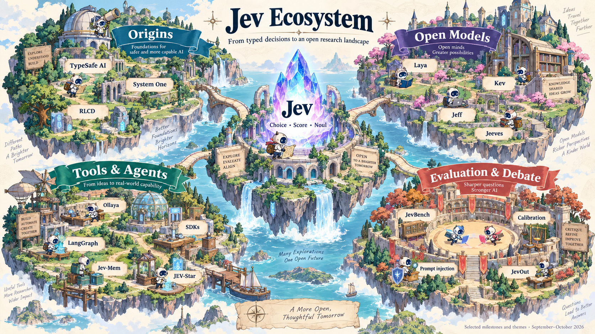

<p align="center"></p>

# AwesomeJev



A curated, English-language directory of **TypeSafe AI’s Jev** and the emerging ecosystem of typed decision models: original releases, community discussions, open infrastructure, model weights, datasets, and research.

**Start with the original announcement:** [Introducing System One Models & Jev — September 15, 2026](https://typesafe.ai/blog/introducing-system-one-models-and-jev).

## Big News

-  **[2026-10-01]** Cloudflare releases Clef and Clef-flash, open-weight multimodal decision models with Jev-compatible interfaces. [Announcement](https://blog.cloudflare.com/clef-decision-models/). [Clef](https://huggingface.co/Cloudflare/clef) and [Clef-flash](https://huggingface.co/Cloudflare/clef-flash) weights and inference code are available. Launch discussion: [626 points / 217 comments on Hacker News](https://news.ycombinator.com/item?id=49923692), observed 2026-10-04.
-  **[2026-09-30]** JevSpawn proposes adaptive agentic inference with compositional action spaces. [Paper](https://arxiv.org/abs/2610.00437).
-  **[2026-09-29]** Chinese-Jev introduces Chinese-language decision training and CJ-Bench. [Paper](https://arxiv.org/abs/2609.36965). Weights remain pending in the checked repository.
-  **[2026-09-29]** A broad Jev evaluation examines 37 datasets, calibration, and answer formats. [Paper](https://arxiv.org/abs/2609.37647).
-  **[2026-09-24]** JevOut investigates how natural-looking context can redirect typed decisions. [Paper](https://arxiv.org/abs/2609.30243).
-  **[2026-09-22]** Visual Jev explores efficient decisions over shared visual context. [Paper](https://arxiv.org/abs/2609.25845).
-  **[2026-09-21]** Jev-Mem introduces a System One controller for agent memory. [Paper](https://arxiv.org/abs/2609.23986).
-  **[2026-09-18]** Laya 0.1.0 is published on PyPI, an early runtime release in the open decision-model ecosystem. [Release](https://pypi.org/project/laya/0.1.0/). This dates the Python package, not the model checkpoints.
-  **[2026-09-16]** Vercel adds Jev to AI Gateway. [Announcement](https://vercel.com/changelog/typesafe-ai-jev-now-available-on-ai-gateway).
-  **[2026-09-15]** TypeSafe AI introduces Jev and System One models. [Original announcement](https://typesafe.ai/blog/introducing-system-one-models-and-jev).

Jev evaluates supplied state against typed questions and returns choices, scores, or yes/no probabilities. Hosted Jev is proprietary; public SDKs and independent open-weight alternatives are different artifacts. No official downloadable Jev weights or architecture paper were located in this review. Schema validity does not establish factual correctness, calibration on every distribution, or immunity to prompt injection. See the [official documentation](https://docs.typesafe.ai/introduction), [model limitations](https://docs.typesafe.ai/model-jaggedness/jev-1.13), and research below.

[Machine-readable catalog](data/resources.json) · [Paper citations](references.bib) · [Curation methodology](METHODOLOGY.md) · [Contributing](CONTRIBUTING.md)

| Explore | Entries | Subcategories | Coverage |
| --- | ---: | ---: | --- |
|  [1. Origins and official resources](#1-origins-and-official-resources) | **12** | 1 | Original announcement, documentation, and first-party references |
|  [2. Community discussion and writing](#2-community-discussion-and-writing) | **30** | 4 | Popular threads, technical articles, debates, and discovery directories |
|  [3. Infrastructure, models, and applications](#3-infrastructure-models-and-applications) | **58** | 9 | SDKs, integrations, open models, runtimes, benchmarks, and applications |
|  [4. Research papers](#4-research-papers) | **47** | 8 | 45 post-launch preprints + 2 historical-context papers |
| **Total** | **147** | **22** | Catalog entries; one project may appear in multiple resource types |

Dates use **[YYYY-MM-DD]**. Each label distinguishes publication, submission, repository creation, or cataloging. **Cataloged** means the original publication date is unverified; repository creation does not establish a public release date. See [date evidence and conventions](METHODOLOGY.md#dates-and-news). Topic icons are navigation cues, not publisher logos.

## Hands-on tutorials

**[2026-10-03]** [Jev beginner guide: typed decisions, support routing, and remote open-model experiments](tutorials/jev-hands-on/README.md). Includes a runnable official SDK example, offline policy/SDK tests, twelve synthetic tickets, and two measured Laya runs on one remote RTX 3090. See the [actual results and lessons](tutorials/jev-hands-on/RESULTS.md); official hosted Jev live results are pending API-key configuration.

## Contents

- [Hands-on tutorials](#hands-on-tutorials)
- [1. Origins and official resources](#1-origins-and-official-resources)
  - [Launch and first-party references](#launch-and-first-party-references)
- [2. Community discussion and writing](#2-community-discussion-and-writing)
  - [Popular Hacker News discussions](#popular-hacker-news-discussions)
  - [Technical blogs and tutorials](#technical-blogs-and-tutorials)
  - [Reddit debates](#reddit-debates)
  - [Discovery directories](#discovery-directories)
- [3. Infrastructure, models, and applications](#3-infrastructure-models-and-applications)
  - [Official SDKs and tools](#official-sdks-and-tools)
  - [Hosted access and framework guides](#hosted-access-and-framework-guides)
  - [Browser and agent infrastructure](#browser-and-agent-infrastructure)
  - [Language clients and data systems](#language-clients-and-data-systems)
  - [Open-weight decision models](#open-weight-decision-models)
  - [Training pipelines and announced releases](#training-pipelines-and-announced-releases)
  - [Local runtimes and alternative implementations](#local-runtimes-and-alternative-implementations)
  - [Benchmarks, calibration, and datasets](#benchmarks-calibration-and-datasets)
  - [Examples, games, and learning projects](#examples-games-and-learning-projects)
- [4. Research papers](#4-research-papers)
  - [Surveys and broad evaluations](#surveys-and-broad-evaluations)
  - [Judging, calibration, and reliability](#judging-calibration-and-reliability)
  - [Robustness and security](#robustness-and-security)
  - [Agent memory, routing, and control](#agent-memory-routing-and-control)
  - [Open and alternative decision-model methods](#open-and-alternative-decision-model-methods)
  - [Networking and edge systems](#networking-and-edge-systems)
  - [Domain applications and multilingual models](#domain-applications-and-multilingual-models)
  - [Historical context cited in community debate](#historical-context-cited-in-community-debate)
- [Citation](#citation)

## 1. Origins and official resources

### Launch and first-party references

-  **[2026-09-15]** · Published · **[Introducing System One Models & Jev](https://typesafe.ai/blog/introducing-system-one-models-and-jev)** — `Official`. Diogo Almeida introduces Jev, the System One framing, RLCD, launch demonstrations, and the qualifications behind the reported performance gains. The starting point for this collection.
-  **[2026-10-03]** · Cataloged · **[TypeSafe manifesto](https://typesafe.ai/manifesto)** — `Official`. The company’s argument for models designed to make decisions inside software.
-  **[2026-09-10]** · Published · **[The Bitterest Lesson](https://typesafe.ai/blog/bitterest-lesson)** — `Official`. Founder’s research perspective on the objectives and data used to train useful models. Background to the Jev launch.
-  **[2026-06-19]** · Published · **[AI: too good to be true, too bad to be useful](https://typesafe.ai/blog/ai-too-good-to-be-true-too-bad-to-be-useful-typesafe-ai)** — `Official`. TypeSafe’s argument about the gap between conversational ability and dependable automation.
-  **[2026-10-03]** · Cataloged · **[Introduction and quick start](https://docs.typesafe.ai/introduction)** — `Official`. The official entry point for sending state and typed questions to Jev.
-  **[2026-10-03]** · Cataloged · **[Choice, Score, and Noul](https://docs.typesafe.ai/primitives)** — `Official`. Definitions of the three output primitives, including probability distributions and answer shapes.
-  **[2026-10-03]** · Cataloged · **[Confidence](https://docs.typesafe.ai/confidence)** — `Official`. How TypeSafe distinguishes answer probability from confidence and uses them in workflows.
-  **[2026-10-03]** · Cataloged · **[Model reference](https://docs.typesafe.ai/models)** — `Official`. Version identifiers, supported inputs, limits, and current service specifications.
-  **[2026-10-03]** · Cataloged · **[Jev 1.13 jaggedness](https://docs.typesafe.ai/model-jaggedness/jev-1.13)** — `Official`. First-party documentation of uneven capabilities and known weak spots. Essential context for evaluating launch claims.
-  **[2026-10-03]** · Cataloged · **[Patterns and cookbooks](https://docs.typesafe.ai/cookbooks)** — `Official`. Implementation guides for routing, scoring, fan-out, classification, search, and other bounded decisions.
-  **[2026-10-03]** · Cataloged · **[Workflow evaluations](https://evals.typesafe.ai/)** — `Official`. Vendor-run workflow comparisons, examples, and methodology; reference-model agreement is not the same as human ground truth.
-  **[2026-10-03]** · Cataloged · **[Documentation index](https://docs.typesafe.ai/llms.txt)** — `Official`. Machine-readable index of official documentation for deeper exploration.


## 2. Community discussion and writing

Hacker News threads are ordered by observed points within the retrieved candidates. Counts are a **2026-10-03 snapshot**, not live metrics or a quality ranking. The [catalog](data/resources.json) records per-entry attention metrics and sources; see the [methodology](METHODOLOGY.md#popularity) for the collection method. Blogs and Reddit threads are selected for their relevance; no cross-platform popularity claim is made.

### Popular Hacker News discussions

| Discussion | Points / comments | What it covers |
| --- | ---: | --- |
|  **Introducing System One Models and Jev**<br>**[2026-09-15]** · Submitted<br>[Discussion](https://news.ycombinator.com/item?id=49717558) · [Original](https://typesafe.ai/blog/introducing-system-one-models-and-jev) | 1,989 / 520 | Launch discussion with founder participation, questions about the API, architecture disclosure, calibration, and evaluation. |
|  **Jev in 25 Lines of Python**<br>**[2026-09-23]** · Submitted<br>[Discussion](https://news.ycombinator.com/item?id=49812769) · [Original](https://www.nobodywho.ai/posts/jev-in-25-lines/) | 691 / 212 | A deliberately minimal, explicitly satirical local implementation using option-token probabilities; the discussion probes what this does and does not reproduce. |
|  **Ollaya – Ollama for open-source, Jev-style decision models**<br>**[2026-09-25]** · Submitted<br>[Discussion](https://news.ycombinator.com/item?id=49848269) · [Original](https://ollaya.dev/) | 617 / 145 | Discussion of a local runtime for open decision models and compatibility with the TypeSafe interface. |
|  **Jeff – Jev-compatible 0.8B decision models, trained at home, ~30 ms**<br>**[2026-09-28]** · Submitted<br>[Discussion](https://news.ycombinator.com/item?id=49883844) · [Original](https://github.com/firelex/jeff) [](https://github.com/firelex/jeff) | 574 / 225 | Release discussion for Jeff’s small decision models, local inference, and training approach. |
|  **Kev: Tiny Jev-like family of decision models built on top of Qwen3.5**<br>**[2026-09-21]** · Submitted<br>[Discussion](https://news.ycombinator.com/item?id=49783999) · [Original](https://github.com/jaredpalmer/kev/tree/main) [](https://github.com/jaredpalmer/kev) | 462 / 211 | Kev release discussion covering open weights, implementation choices, comparisons, and model size. |
|  **OpenAI is well positioned to fast-follow Jev**<br>**[2026-09-22]** · Submitted<br>[Discussion](https://news.ycombinator.com/item?id=49802161) · [Original](https://arcturus-labs.com/blog/2026/09/21/will-openai-eat-jevs-lunch/) | 328 / 233 | Debate about incumbent model providers, product differentiation, and Jev-style interfaces; market predictions are opinions. |
|  **Show HN: Jev Plays Pokémon Red**<br>**[2026-09-25]** · Submitted<br>[Discussion](https://news.ycombinator.com/item?id=49845172) · [Original](https://jev-pokemon.vercel.app/) | 282 / 124 | A Pokémon Red demonstration and discussion of the role of game state, legal actions, and the surrounding agent harness. |
|  **Jeeves. Reasoning improves Jev-like decision models**<br>**[2026-09-29]** · Submitted<br>[Discussion](https://news.ycombinator.com/item?id=49891290) · [Original](https://github.com/PostHog/jeeves) [](https://github.com/PostHog/jeeves) | 242 / 95 | Jeeves release discussion about adding reasoning to Jev-style classifiers. |
|  **Jev-Leftpad**<br>**[2026-09-21]** · Submitted<br>[Discussion](https://news.ycombinator.com/item?id=49784706) · [Original](https://github.com/f/jev-leftpad) [](https://github.com/f/jev-leftpad) | 234 / 87 | A humorous left-padding package powered by model decisions; useful as community history, not an infrastructure recommendation. |
|  **Language models for text classification: From bag-of-words to Jev**<br>**[2026-09-29]** · Submitted<br>[Discussion](https://news.ycombinator.com/item?id=49891203) · [Original](https://magazine.sebastianraschka.com/p/classifier-history-and-jev) | 213 / 10 | Discussion of Sebastian Raschka’s history of text classification and explanation of Jev-style decision interfaces. |
|  **I turned Jev into a (lousy) chatbot**<br>**[2026-09-20]** · Submitted<br>[Discussion](https://news.ycombinator.com/item?id=49778162) · [Original](https://github.com/kyle-pena-nlp/jevchat/) [](https://github.com/kyle-pena-nlp/jevchat) | 177 / 50 | An experiment generating text through repeated character choices, illustrating the limits of using Jev as a chatbot. |
|  **Reverse-engineered Jev-like model**<br>**[2026-09-16]** · Submitted<br>[Discussion](https://news.ycombinator.com/item?id=49731282) · [Original](https://github.com/vinnylarouge/jevlike) [](https://github.com/vinnylarouge/jevlike) | 169 / 24 | Early independently built Jev-like option scorer; “reverse-engineered” in the thread title does not establish access to TypeSafe’s architecture. |
|  **Show HN: JevBench, a reproducible benchmark for typed decision models**<br>**[2026-09-22]** · Submitted<br>[Discussion](https://news.ycombinator.com/item?id=49800574) · [Original](https://benchmarkheaven.com/jev-models) | 153 / 39 | Discussion of JevBench, its evaluation design, and cross-model comparisons. |
|  **Jev Can't Be Calibrated**<br>**[2026-09-23]** · Submitted<br>[Discussion](https://news.ycombinator.com/item?id=49816899) · [Original](https://www.alexmolas.com/2026/09/23/jev-cant-be-calibrated.html) | 65 / 61 | Debate about distribution-dependent calibration and what a probability returned by Jev means. |

### Technical blogs and tutorials

-  **[2026-09-21]** · Published · **[Jev introduces a new shape of LLM—System One, aka Decision Models](https://simonwillison.net/2026/Sep/21/jev/)** — `Article`. Simon Willison explains the interface, experiments, open recreations, and the difficulty of inspecting a numeric decision.
-  **[2026-09-29]** · Published · **[Language Models for Text Classification: From Bag-of-Words to Jev](https://magazine.sebastianraschka.com/p/classifier-history-and-jev)** — `Article`. Sebastian Raschka places Jev in the history of classifiers, readout methods, and calibration; proposed internals are explicitly inferential.
-  **[2026-09-17]** · Published · **[Building a Harness with Jev](https://www.langchain.com/blog/building-a-harness-with-jev)** — `Article`. LangChain’s tutorial on integrating bounded decisions into an agent loop, including routing and evaluation.
-  **[2026-09-25]** · Published · **[Building Prod with Jev and LangGraph](https://www.langchain.com/blog/building-prod-with-jev-and-langgraph)** — `Article`. LangChain’s worked document-review workflow combines Jev classifications, graph orchestration, and escalation.
-  **[2026-09-21]** · Published · **[What is Jev? — Browserbase](https://www.browserbase.com/blog/what-is-jev)** — `Article`. Browserbase explains how Stagehand can use Jev for bounded browser actions and fall back to an LLM.
-  **[2026-09-18]** · Published · **[You could have built Jev](https://sgnt.ai/p/jev/)** — `Article`. Pete Sergeant explains option scoring and compares independent implementations; reproducing an interface does not prove model equivalence.
-  **[2026-09-23]** · Published · **[Jev can’t be calibrated](https://www.alexmolas.com/2026/09/23/jev-cant-be-calibrated.html)** — `Article`. Alex Molas argues that calibration must be checked against the deployment distribution rather than assumed from a model-wide claim.
-  **[2026-09-22]** · Published · **[Jev or a fine-tuned small model?](https://www.distillabs.ai/blog/jev-or-a-fine-tuned-small-model-we-built-a-pipeline-with-both-to-see-the-real-difference/)** — `Article`. Distil Labs reports a pipeline experiment comparing Jev and task-specific models on triage and invoice decisions. Results describe that vendor’s setup.
-  **[2026-10-01]** · Published · **[Introducing Clef: our open-source decision models, and new RL fine-tuning platform](https://blog.cloudflare.com/clef-decision-models/)** — `Publisher announcement`. Cloudflare introduces Jev-compatible multimodal decision models and describes its RL fine-tuning platform. Includes architecture and deployment details; benchmark comparisons are vendor-reported. [Clef](https://huggingface.co/Cloudflare/clef) · [Clef-flash](https://huggingface.co/Cloudflare/clef-flash) · [Hacker News](https://news.ycombinator.com/item?id=49923692).
-  **[2026-10-02]** · Published · **[Jev for Python engineers](https://vercel.com/blog/jev-for-python-engineers)** — `Technical tutorial`. Vercel demonstrates typed Choice, Score, and Noul calls through its experimental Python evaluation API, including classification and AST generation. The examples also discuss failure cases. [GitHub](https://github.com/vercel-labs/ai-python) [](https://github.com/vercel-labs/ai-python) · [AST example](https://github.com/vercel-labs/ai-python/blob/main/examples/models/gateway/jev_python_ast.py) [](https://github.com/vercel-labs/ai-python).
-  **[2026-10-02]** · Published · **[Jev is Poorly Calibrated](https://maximumeffort.substack.com/p/jev-is-poorly-calibrated)** — `Independent analysis`. Dylan Black tests option probabilities against known physical distributions and probes arithmetic failures. An author-run distribution-matching study, rather than a universal calibration verdict.

### Reddit debates

-  **[2026-10-03]** · Cataloged · **[Laya author’s prior-work discussion](https://www.reddit.com/r/LocalLLaMA/comments/1wihgum/i_literally_built_the_jev_architecture_one_year/)** — `Discussion`. First-person account linking earlier sales-prediction and confidence-routing work. Architectural equivalence and priority claims are disputed and are not established by this thread.
-  **[2026-10-03]** · Cataloged · **[Is Jev a new model class or a classifier?](https://www.reddit.com/r/LocalLLaMA/comments/1woe70t/jev_isnt_new_tech_its_marketing_targets_people/)** — `Discussion`. Community debate about novelty, zero-shot classification, and the difference between a useful product and a new architecture.

### Discovery directories

-  **[2026-09-17]** · Repository created · **[Awesome Jev / TypeSafe — AbdelStark](https://github.com/AbdelStark/awesome-typesafe-jev)** [](https://github.com/AbdelStark/awesome-typesafe-jev) — `Directory`. Broad community directory of integrations, demos, and independent tests. Used for discovery; listed projects should be checked at their original sources.
-  **[2026-09-19]** · Repository created · **[Awesome Jev — heyjunpenn](https://github.com/heyjunpenn/awesome-jev)** [](https://github.com/heyjunpenn/awesome-jev) — `Directory`. Larger community project catalog useful for discovering the long tail of Jev applications.
-  **[2026-09-18]** · Repository created · **[Awesome Jev — Amal-David](https://github.com/Amal-David/awesome-jev)** [](https://github.com/Amal-David/awesome-jev) — `Directory`. Community collection with projects, skills, demonstrations, and a curated social-post gallery.


## 3. Infrastructure, models, and applications

Official clients, hosted access, independent weights, and local implementations are labeled separately. A compatible API does not imply the same architecture, training data, calibration, or capability as TypeSafe’s Jev. Model and data licenses remain those of their respective publishers.

### Official SDKs and tools

-  **[2026-09-04]** · Repository created · **[TypeSafe Python SDK](https://github.com/typesafe-ai/typesafe-sdk-python)** [](https://github.com/typesafe-ai/typesafe-sdk-python) — `Official open-source code`. Official synchronous and asynchronous Python client for Jev.
-  **[2026-09-04]** · Repository created · **[TypeSafe JavaScript / TypeScript SDK](https://github.com/typesafe-ai/typesafe-sdk-js)** [](https://github.com/typesafe-ai/typesafe-sdk-js) — `Official open-source code`. Official client with inferred answer types and typed question helpers.
-  **[2026-08-24]** · Repository created · **[TypeSafe Agent Skills](https://github.com/typesafe-ai/skills)** [](https://github.com/typesafe-ai/skills) — `Official open-source code`. Official integration guidance for coding agents and skill-compatible tools.
-  **[2026-08-08]** · Repository created · **[System One Adapter](https://github.com/typesafe-ai/system-one-adapter-python)** [](https://github.com/typesafe-ai/system-one-adapter-python) — `Official open-source code`. Official adapter that runs the decision interface over other LLM APIs for comparisons; it does not expose Jev weights.
-  **[2026-09-28]** · Repository created · **[WorkflowEvals](https://github.com/typesafe-ai/WorkflowEvals)** [](https://github.com/typesafe-ai/WorkflowEvals) — `Official open-source code`. Source code for TypeSafe’s workflow evaluations. Its reference answers come from other models.
-  **[2026-09-23]** · Repository created · **[TypeSafe n8n nodes](https://github.com/typesafe-ai/n8n-nodes-typesafe-ai)** [](https://github.com/typesafe-ai/n8n-nodes-typesafe-ai) — `Official open-source code`. Official repository for connecting the TypeSafe API to n8n workflows.

### Hosted access and framework guides

-  **[2026-09-16]** · Published · **[Vercel AI Gateway](https://vercel.com/changelog/typesafe-ai-jev-now-available-on-ai-gateway)** — `Hosted integration`. Provider announcement and usage examples for accessing Jev through AI Gateway.
-  **[2026-10-03]** · Cataloged · **[Cloudflare Workers AI](https://developers.cloudflare.com/ai/models/typesafe/jev/)** — `Hosted integration`. Provider-maintained Jev model page and structured evaluation examples.
-  **[2026-10-03]** · Cataloged · **[OpenRouter Jev playground](https://openrouter.ai/labs/jev/compile)** — `Hosted integration`. Provider playground for turning a task into typed Jev questions.
-  **[2026-10-03]** · Cataloged · **[Netlify AI Gateway](https://docs.netlify.com/build/ai-gateway/overview/)** — `Hosted integration`. Provider documentation covering gateway configuration and TypeSafe integration.
-  **[2026-10-02]** · Published · **[Vercel AI SDK for Python: experimental Jev evaluation](https://github.com/vercel-labs/ai-python)** [](https://github.com/vercel-labs/ai-python) — `Hosted integration`. Apache-2.0 Python SDK with an experimental typed evaluation API for Jev through AI Gateway. Supports Choice, Score, and Noul questions; the date refers to the integration article, not repository creation. [Integration article](https://vercel.com/blog/jev-for-python-engineers) · [License](https://github.com/vercel-labs/ai-python/blob/main/LICENSE) [](https://github.com/vercel-labs/ai-python).

### Browser and agent infrastructure

-  **[2026-09-16]** · Repository created · **[Jev Ultrafast](https://github.com/browser-use/jev-ultrafast)** [](https://github.com/browser-use/jev-ultrafast) — `Open-source code`. Browser Use’s agent represents available browser actions as candidates and uses Jev to select operations and targets.
-  **[2026-09-17]** · Repository created · **[Jev Browser](https://github.com/jkudish/jev-browser)** [](https://github.com/jkudish/jev-browser) — `Open-source code`. Playwright navigation exposed as a library, CLI, and MCP server, with bounded action selection.
-  **[2026-09-16]** · Repository created · **[Jev MCP — Python](https://github.com/blakestone-x/jev-mcp)** [](https://github.com/blakestone-x/jev-mcp) — `Open-source code`. MCP server exposing classification, scoring, checking, matching, and screening through Jev.
-  **[2026-09-17]** · Repository created · **[Jev MCP — Node](https://github.com/jkudish/jev-mcp)** [](https://github.com/jkudish/jev-mcp) — `Open-source code`. MCP tools for evidence checks, ranking, candidate selection, extraction, and patch review.
-  **[2026-09-20]** · Repository created · **[Jev-Mem](https://github.com/libingzheren/Jev-Mem)** [](https://github.com/libingzheren/Jev-Mem) — `Open-source code`. Agent memory architecture using fast decisions for organization and retrieval, with a separate model for answer synthesis. [Paper](https://arxiv.org/abs/2609.23986).

### Language clients and data systems

-  **[2026-09-20]** · Repository created · **[DuckDB Jev](https://github.com/prasanthj/duckdb-jev)** [](https://github.com/prasanthj/duckdb-jev) — `Open-source code`. DuckDB extension for Jev-backed predicates, classification, and scores over rows.
-  **[2026-09-17]** · Repository created · **[pg-jev](https://github.com/realZachi/pg-jev)** [](https://github.com/realZachi/pg-jev) — `Open-source code`. PostgreSQL extension for typed judgments and probability predicates over table rows.
-  **[2026-09-18]** · Repository created · **[jev — CLI and skill](https://github.com/okooo5km/jev)** [](https://github.com/okooo5km/jev) — `Open-source code`. Community command-line wrapper supporting direct TypeSafe and OpenRouter backends.
-  **[2026-09-19]** · Repository created · **[Jev Java](https://github.com/jevkit/jev-java)** [](https://github.com/jevkit/jev-java) — `Open-source code`. Community Java client with typed questions and configurable retries.
-  **[2026-09-20]** · Repository created · **[jev — Haskell](https://github.com/realbogart/jev)** [](https://github.com/realbogart/jev) — `Open-source code`. Community Haskell client with composable typed questions and probability-preserving responses.
-  **[2026-09-30]** · Repository created · **[Jev Doc Search](https://github.com/VectifyAI/jev-doc-search)** [](https://github.com/VectifyAI/jev-doc-search) — `Open-source application`. VectifyAI uses Jev choices to navigate PageIndex document trees and select relevant PDF pages without an embedding index. Public Apache-2.0 code; hosted model access is a separate dependency.

### Open-weight decision models

-  **[2026-09-18]** · Repository created · **[Laya](https://github.com/NandhaKishorM/laya)** [](https://github.com/NandhaKishorM/laya) — `Open weights and code`. Independent encoder-based decision models with English, multilingual, and workflow-specialist checkpoints; includes training and local serving. [English weights](https://huggingface.co/convaiinnovations/laya) · [Multilingual weights](https://huggingface.co/convaiinnovations/laya-multilingual) · [Demo](https://huggingface.co/spaces/convaiinnovations/laya-demo).
-  **[2026-09-17]** · Repository created · **[Kev](https://github.com/jaredpalmer/kev)** [](https://github.com/jaredpalmer/kev) — `Open weights and code`. Qwen-based family with released decision checkpoints, training code, evaluation suites, and TypeSafe-compatible serving. [0.8B](https://huggingface.co/jaredpalmer/kev-0.8b) · [4B](https://huggingface.co/jaredpalmer/kev-4b) · [9B](https://huggingface.co/jaredpalmer/kev-9b) · [27B](https://huggingface.co/jaredpalmer/kev-27b) · [Demo](https://huggingface.co/spaces/jaredpalmer/kev).
-  **[2026-09-18]** · Repository created · **[Bespoke Nimble](https://github.com/bespokelabsai/nimble)** [](https://github.com/bespokelabsai/nimble) — `Open weights and code`. Independent decision model with a contrastive data-curation recipe and public benchmark comparisons. Its authors state it was not distilled from Jev. [Weights](https://huggingface.co/bespokelabs/Bespoke-Nimble-9B).
-  **[2026-09-28]** · Repository created · **[Jeff — firelex](https://github.com/firelex/jeff)** [](https://github.com/firelex/jeff) — `Open weights and code`. Small decision models with local inference and domain adapters; distinct from other projects also called Jeff. [Weights](https://huggingface.co/mstrasser/Jeff-Qwen3.5-0.8B).
-  **[2026-09-29]** · Repository created · **[Jeeves](https://github.com/PostHog/jeeves)** [](https://github.com/PostHog/jeeves) — `Open weights and code`. PostHog’s reasoning decision model, adding a diffusion drafter to a Qwen-based classifier; not a strictly one-pass decision model. [Weights](https://huggingface.co/PostHog/jeeves) · [FP8 weights](https://huggingface.co/PostHog/jeeves-fp8).
-  **[2026-09-23]** · Repository created · **[Contrastive Language Models](https://github.com/Contrastive-LM/CLM)** [](https://github.com/Contrastive-LM/CLM) — `Open weights and code`. Contrastive state/action modeling with a TypeSafe-compatible API and an independently released 8B model. [Weights](https://huggingface.co/Contrastive-LM/CLM-v0.1-8B).
-  **[2026-09-30]** · Repository created · **[Vev](https://github.com/Xiaooolong/vev)** [](https://github.com/Xiaooolong/vev) — `Open weights and code`. Independent visual and textual decision models based on Qwen3.5, with 4B and 9B releases. [4B weights](https://huggingface.co/CountingSheep/vev-4b) · [9B weights](https://huggingface.co/CountingSheep/vev-9b).
-  **[2026-09-29]** · Repository created · **[WebJev](https://github.com/lexmount/WebJev)** [](https://github.com/lexmount/WebJev) — `Open weights and code`. Decision-model fine-tune specialized for browser actions; includes live-web data and evaluation harnesses. [Weights](https://huggingface.co/Lexmount/WebJev-35B-A3B) · [Dataset](https://huggingface.co/datasets/Lexmount/WebJev).
-  **[2026-09-17]** · Repository created · **[NanoJev](https://github.com/TianyuCodings/NanoJev)** [](https://github.com/TianyuCodings/NanoJev) — `Open weights and code`. Compact 0.6B model and training pipeline for parallel decisions in game environments; its scope is narrower than general hosted Jev. [Weights](https://huggingface.co/C-Tianyu/NanoJev) · [Dataset](https://huggingface.co/datasets/C-Tianyu/NanoJev-Data).
-  **[2026-09-20]** · Paper submitted · **[this-that-model-1.0](https://huggingface.co/flock-io/this-that-model-1.0)** — `Open weights`. A 2B typed-decision model with a research preprint. Reported speed and cost depend on its hardware and evaluation setup. [Paper](https://arxiv.org/abs/2609.23886).
-  **[2026-10-01]** · Published · **[Clef and Clef-flash](https://huggingface.co/Cloudflare/clef)** — `Open weights and code`. Cloudflare releases independent multimodal decision models with Jev-compatible interfaces, using Qwen3.8-27B and Qwen3.5-9B backbones respectively. Weights and decision-head inference code are available under Apache-2.0. [Clef-flash](https://huggingface.co/Cloudflare/clef-flash) · [Announcement](https://blog.cloudflare.com/clef-decision-models/).
-  **[2026-10-01]** · Published · **[Strands Decider 2B](https://github.com/strands-labs/strands-decider)** [](https://github.com/strands-labs/strands-decider) — `Open weights and code`. Independent Qwen3.5-2B-Base decision model with LoRA and a pointer readout for runtime-supplied Choice, Score, and Noul questions. Code and weights are Apache-2.0; training data retain their source licenses. [Hugging Face](https://huggingface.co/StrandsAgents/strands-decider-2B-hobson-v19) · [Announcement](https://strandsagents.com/blog/introducing-strands-decider/).
-  **[2026-10-04]** · Cataloged · **[GEV-26B-Decide](https://huggingface.co/autotrust/GEV-26B-Decide)** — `Open weights and code`. AutoTrust decision model based on Gemma 4 26B-A4B, formerly named JEV-Gemma4-26B-A4B with unchanged weights. Adapter, head, and calibration files use Apache-2.0; the backbone retains Gemma terms. Original release date is unverified.
-  **[2026-10-01]** · Repository created · **[Gutsy](https://github.com/kouhxp/gutsy)** [](https://github.com/kouhxp/gutsy) — `Open weights and code`. Small Qwen3.5-0.8B decision model exposing a Jev-style API through llama.cpp, with CPU-oriented GGUF quantizations. The repository and released model weights use Apache-2.0; upstream training datasets have separate terms. [Hugging Face](https://huggingface.co/kouhxp/gutsy).

### Training pipelines and announced releases

-  **[2026-09-28]** · Repository created · **[Chinese-Jev](https://github.com/gulucaptain/Chinese-Jev)** [](https://github.com/gulucaptain/Chinese-Jev) — `Code available; weights pending`. Chinese decision-model training, calibration, and evaluation code. The project lists trained Chinese-Jev weights as planned, so this entry is not a downloadable-weight release. [Project](https://gulucaptain.github.io/Chinese-Jev/) · [Paper](https://arxiv.org/abs/2609.36965) · [CJ-Bench](https://huggingface.co/datasets/bbldCVer-hf/CJ-Bench) · [CJ-Dataset](https://huggingface.co/datasets/bbldCVer-hf/CJ-Dataset).

### Local runtimes and alternative implementations

-  **[2026-09-23]** · Repository created · **[Ollaya](https://github.com/ollaya-dev/ollaya)** [](https://github.com/ollaya-dev/ollaya) — `Open-source code`. Local runtime for pulling and serving multiple decision-model families behind a TypeSafe-compatible API. Independent of Ollama and TypeSafe.
-  **[2026-09-21]** · Repository created · **[AnyJev](https://github.com/nokia-applied-research/AnyJev)** [](https://github.com/nokia-applied-research/AnyJev) — `Open-source code`. Nokia Applied Research’s library for typed readouts from open LLMs, including option-bias correction and calibration modes.
-  **[2026-09-16]** · Repository created · **[SemIf-OpenJev](https://github.com/TheoLeeCJ/SemIf-OpenJev)** [](https://github.com/TheoLeeCJ/SemIf-OpenJev) — `Open-source code`. Open-model option scoring and semantic conditionals; formerly named OpenJev and SemIf. This is an independent implementation.
-  **[2026-09-17]** · Repository created · **[OpenJev SGLang](https://github.com/ekzhang/openjev-sglang)** [](https://github.com/ekzhang/openjev-sglang) — `Open-source code`. Prefill-only decision serving over open models using SGLang.
-  **[2026-09-18]** · Repository created · **[OpenJev — DiffusionGemma](https://github.com/razorback16/openjev)** [](https://github.com/razorback16/openjev) — `Open-source code`. Independent TypeSafe-compatible server reading typed decisions from DiffusionGemma, with NVIDIA and Apple silicon paths.
-  **[2026-09-17]** · Repository created · **[open-jev — daseinlabs](https://github.com/daseinlabs/open-jev)** [](https://github.com/daseinlabs/open-jev) — `Open-source code`. Local Gemma option scorer using shared context and candidate sequence likelihoods.
-  **[2026-09-16]** · Repository created · **[Jevlike](https://github.com/vinnylarouge/jevlike)** [](https://github.com/vinnylarouge/jevlike) — `Open-source code`. Independent model and training starter that scores a changing set of candidate options in one pass.

### Benchmarks, calibration, and datasets

-  **[2026-09-19]** · Repository created · **[JevBench](https://github.com/fstandhartinger/jevbench)** [](https://github.com/fstandhartinger/jevbench) — `Open-source code`. Independent multi-model benchmark with versioned scoring and results. Composite rankings depend on the published accuracy, calibration, latency, and cost methodology. [Leaderboard](https://www.benchmarkheaven.com/jev-models).
-  **[2026-09-18]** · Repository created · **[Jevals](https://github.com/Jevals/jevals-data)** [](https://github.com/Jevals/jevals-data) — `Open-source code`. Public benchmark suites and per-decision results for hosted Jev and comparator models. [Results](https://jevals.com/) · [Methodology](https://jevals.com/methodology/).
-  **[2026-10-03]** · Cataloged · **[Jev Decision Index](https://huggingface.co/spaces/multimodalart/jev-decision-index)** — `Benchmark`. Interactive community comparison of decision-model systems hosted as a Hugging Face Space.
-  **[2026-09-17]** · Repository created · **[Janus](https://github.com/FirasSX914/Janus)** [](https://github.com/FirasSX914/Janus) — `Open-source code`. Calibration and cascade experiments using Jev and a larger fallback model on labeled classification tasks.
-  **[2026-09-21]** · Repository created · **[jev-certify](https://github.com/nikkoxgonzales/jev-certify)** [](https://github.com/nikkoxgonzales/jev-certify) — `Open-source code`. Conformal routing and auditing toolkit with a CLINC150 study; its guarantees depend on calibration and deployment assumptions.
-  **[2026-09-24]** · Repository created · **[Jev benchmarking — AppliedMachineLearning-Lab](https://github.com/AppliedMachineLearning-Lab/jev-benchmarking)** [](https://github.com/AppliedMachineLearning-Lab/jev-benchmarking) — `Open-source code`. Code accompanying the 37-dataset Jev evaluation; keep model versions and request templates fixed when reproducing it. [Paper](https://arxiv.org/abs/2609.37647).
-  **[2026-09-24]** · Repository created · **[RLCDAlignBench](https://github.com/sumleo/RLCDAlignBench)** [](https://github.com/sumleo/RLCDAlignBench) — `Open-source code`. Benchmark of typed decisions for detecting alignment failures, with code and data linked from its paper. [Paper](https://arxiv.org/abs/2609.29429).
-  **[2026-09-24]** · Repository created · **[JevOut](https://github.com/xzx34/JevOut)** [](https://github.com/xzx34/JevOut) — `Open-source code`. Research code for testing whether natural-looking context changes can redirect a decision model. [Paper](https://arxiv.org/abs/2609.30243) · [Project](https://xzx34.github.io/jevout/).

### Examples, games, and learning projects

-  **[2026-09-19]** · Repository created · **[Jev Cookbook](https://github.com/nexibeo/jev-cookbook)** [](https://github.com/nexibeo/jev-cookbook) — `Open-source code`. Runnable recipes for support triage, classification, search, data cleanup, and browser actions.
-  **[2026-09-19]** · Repository created · **[Jev Explained](https://github.com/davila7/jev-explained)** [](https://github.com/davila7/jev-explained) — `Open-source code`. Interactive educational playground for observing typed decisions and probabilities.
-  **[2026-09-19]** · Repository created · **[Jev Showcase](https://github.com/cobusgreyling/Jev)** [](https://github.com/cobusgreyling/Jev) — `Open-source code`. Unofficial operator lab, smart-home examples, and a TypeScript harness.
-  **[2026-09-22]** · Repository created · **[JEV-Star](https://github.com/sc2musa/Jev_Star)** [](https://github.com/sc2musa/Jev_Star) — `Open-source code`. Research implementation combining Jev action selection with longer-horizon StarCraft II planning.
-  **[2026-09-20]** · Repository created · **[Jev chat](https://github.com/kyle-pena-nlp/jevchat)** [](https://github.com/kyle-pena-nlp/jevchat) — `Open-source code`. Character-by-character generation experiment built on a decision interface; deliberately illustrates an awkward use case.
-  **[2026-09-21]** · Repository created · **[Jev Leftpad](https://github.com/f/jev-leftpad)** [](https://github.com/f/jev-leftpad) — `Open-source code`. Satirical package that uses model decisions for string padding.


## 4. Research papers

Grouped by research topic; chronological within each group. Dates are first arXiv submission dates, while descriptions reflect the version accessed during this review. **Preprint** does not imply peer review. Summaries describe the authors’ work, not independently reproduced findings. Code/model links are included where located; absence of a link means it was not located, not that no artifact exists.

### Surveys and broad evaluations

-  **[2026-09-21]** · Submitted · **[Evaluating Decision Models for Text Annotation in Computational Social Science](https://arxiv.org/abs/2609.24574)** — `Preprint`. Studies computational social-science annotation, comparing accuracy, confidence, and the economics of escalation to LLMs. [PDF](https://arxiv.org/pdf/2609.24574).
-  **[2026-09-24]** · Submitted · **[Jev in the Wild: A Data-Driven Analysis of the Jev Model's Functionality, Applications and Ecosystem](https://arxiv.org/abs/2609.30216)** — `Preprint`. Analyzes 2,170 public Jev-related GitHub projects, distinguishing ecosystem activity from concentrated public attention. [PDF](https://arxiv.org/pdf/2609.30216).
-  **[2026-09-26]** · Submitted · **[Typed Decision Models: An Early Evidence Audit and Evaluation Checklist](https://arxiv.org/abs/2609.32160)** — `Preprint`. Reviews 28 early papers and derives an evaluation checklist. An early evidence map, not a settled verdict on the model class. [PDF](https://arxiv.org/pdf/2609.32160).
-  **[2026-09-29]** · Submitted · **[Evaluating and Benchmarking the System One Model Jev](https://arxiv.org/abs/2609.37647)** — `Preprint`. Evaluates Jev on 37 datasets with frozen prompts and full evaluation splits. Covers calibration, multilingual behavior, and sensitivity to answer formats. [PDF](https://arxiv.org/pdf/2609.37647) · [GitHub](https://github.com/AppliedMachineLearning-Lab/jev-benchmarking) [](https://github.com/AppliedMachineLearning-Lab/jev-benchmarking).
-  **[2026-10-01]** · Submitted · **[Judgement in the Age of Jev: From Evaluation Scarcity to Evaluation Abundance](https://arxiv.org/abs/2610.01231)** — `Preprint`. A conceptual organizational perspective on inexpensive machine evaluation, motivated by Jev. Develops a conditional Jevons-style hypothesis and examines authority, reliance, and complementary costs; not an empirical validation of the product. [PDF](https://arxiv.org/pdf/2610.01231).

### Judging, calibration, and reliability

-  **[2026-09-22]** · Submitted · **[JEV-as-a-Judge: Accept When Confident, Escalate When Unsure](https://arxiv.org/abs/2609.26550)** — `Preprint`. Tests Jev as a first-stage evaluator and routes uncertain decisions to a stronger judge. Benefits vary with workload and reasoning demands. [PDF](https://arxiv.org/pdf/2609.26550).
-  **[2026-09-22]** · Submitted · **[Type-Safe Is Not Error-Free: A Constrained Decision Head Follows the Option Name, Not the Rubric Bound to It](https://arxiv.org/abs/2609.26758)** — `Preprint`. Changes option names while preserving their rubrics to expose semantic label bias despite valid output types. [PDF](https://arxiv.org/pdf/2609.26758).
-  **[2026-09-24]** · Submitted · **[Just Ask Jev: Reinforcement Learning for Calibrated Decisions as a Zero-Shot Detector of AI Alignment Failures](https://arxiv.org/abs/2609.29429)** — `Preprint`. Introduces RLCDAlignBench to study zero-shot detection of alignment failures, including the influence of wording and supplied context. [PDF](https://arxiv.org/pdf/2609.29429) · [GitHub](https://github.com/sumleo/RLCDAlignBench) [](https://github.com/sumleo/RLCDAlignBench).
-  **[2026-09-24]** · Submitted · **[JEV vs. LLMs as Rubric Judges: Cheaper, Faster, and Wrong in the Same Places](https://arxiv.org/abs/2609.29769)** — `Preprint`. Compares rubric judges and shows why correlated errors can limit the accuracy gains of a confidence-based cascade. [PDF](https://arxiv.org/pdf/2609.29769).
-  **[2026-09-27]** · Submitted · **[Beyond Calibration: Do a Typed-Decision Model's Probabilities Obey the Probability Axioms?](https://arxiv.org/abs/2609.33209)** — `Preprint`. Checks logical consistency across related probability questions, distinguishing probability coherence from accuracy and calibration. [PDF](https://arxiv.org/pdf/2609.33209).
-  **[2026-09-30]** · Submitted · **[When the Right Answer Is Missing: An Arithmetic-Dependent Rejection Bottleneck in Jev](https://arxiv.org/abs/2609.39496)** — `Preprint`. Tests arithmetic decisions when no offered answer is valid. Finds a rejection bottleneck relative to answer-present tasks and evaluates binary verification and development-set thresholds as mitigations. [PDF](https://arxiv.org/pdf/2609.39496).
-  **[2026-10-01]** · Submitted · **[Beyond Answer Confidence: A Controlled Audit of Self-Knowledge in a Black-Box Decision Model](https://arxiv.org/abs/2610.01006)** — `Preprint`. Audits whether Jev confidence tracks missing knowledge using controlled information changes and surface-cue interventions. Distinguishes answer calibration from reliable knowledge-boundary detection and tests targeted sufficiency questions. [PDF](https://arxiv.org/pdf/2610.01006) · [GitHub](https://github.com/Syntheme/beyond-answer-confidence) [](https://github.com/Syntheme/beyond-answer-confidence).

### Robustness and security

-  **[2026-09-23]** · Submitted · **[Decision Hijacking: Prompt Injection Attacks on Jev's Typed Probabilistic Decisions](https://arxiv.org/abs/2609.28613)** — `Preprint`. Measures prompt-injection effects on allowed action probabilities and selections; schema constraints do not eliminate decision manipulation. [PDF](https://arxiv.org/pdf/2609.28613).
-  **[2026-09-24]** · Submitted · **[Calibrated Decision Models for Autonomous Penetration-Testing Harnesses: JEV and Laya as System One Decision Layers for LLM-Driven Pentest Agents](https://arxiv.org/abs/2609.28940)** — `Preprint`. Explores Jev and Laya as decision layers in penetration-testing agents. The reported two-run case study is exploratory, not strong causal evidence. [PDF](https://arxiv.org/pdf/2609.28940).
-  **[2026-09-24]** · Submitted · **[JevOut: Natural Context Can Flip Decision Models](https://arxiv.org/abs/2609.30243)** — `Preprint`. Optimizes ordinary-looking context additions that flip initially correct decisions toward a fixed wrong option. [PDF](https://arxiv.org/pdf/2609.30243) · [GitHub](https://github.com/xzx34/JevOut) [](https://github.com/xzx34/JevOut) · [Project](https://xzx34.github.io/jevout/).

### Agent memory, routing, and control

-  **[2026-09-21]** · Submitted · **[Jev-Mem: System-One-Controlled Agentic Memory for Efficient AI Agents](https://arxiv.org/abs/2609.23986)** — `Preprint`. Separates memory-management decisions from answer generation using a System One controller and a multi-relational memory graph. [PDF](https://arxiv.org/pdf/2609.23986) · [GitHub](https://github.com/libingzheren/Jev-Mem) [](https://github.com/libingzheren/Jev-Mem).
-  **[2026-09-22]** · Submitted · **[REFLEX with Jev for Efficient Selective Control in LLM Agents](https://arxiv.org/abs/2609.26532)** — `Preprint`. Studies a Jev-first agent controller with stronger-model fallback and examines when it improves on inexpensive generative cascades. [PDF](https://arxiv.org/pdf/2609.26532).
-  **[2026-09-23]** · Submitted · **[JEV-Star: Fast, Low-Cost StarCraft II Control with Language-Model Planning](https://arxiv.org/abs/2609.27331)** — `Preprint`. Combines fast Jev actions with persistent LLM planning for StarCraft II; the comparison does not isolate planning from all harness changes. [PDF](https://arxiv.org/pdf/2609.27331) · [GitHub](https://github.com/sc2musa/Jev_Star) [](https://github.com/sc2musa/Jev_Star).
-  **[2026-09-24]** · Submitted · **[Harness Tokenomics: A Router for the Enterprise Agentic Control Plane](https://arxiv.org/abs/2609.28919)** — `Preprint`. Examines model routing while accounting for prompt-cache ownership and session boundaries. Savings are based on the paper’s workload and pricing assumptions. [PDF](https://arxiv.org/pdf/2609.28919).
-  **[2026-09-24]** · Submitted · **[Jev-Mobile: Jev as an Executor for Mobile GUI Agents](https://arxiv.org/abs/2609.30186)** — `Preprint`. Uses occasional VLM planning with Jev choosing actions from an Android accessibility-tree action space. [PDF](https://arxiv.org/pdf/2609.30186).
-  **[2026-09-30]** · Submitted · **[JevSpawn: Adaptive Agentic Inference through Compositional Action Spaces](https://arxiv.org/abs/2610.00437)** — `Preprint`. Builds and revises compositional action spaces to connect natural-language tasks with finite probabilistic exploration. [PDF](https://arxiv.org/pdf/2610.00437).
-  **[2026-10-01]** · Submitted · **[Code Owns the Simulation, Jev Owns the Evaluation](https://arxiv.org/abs/2610.01834)** — `Preprint`. Separates evaluation of supplied outcomes from predicting those outcomes across games, ALFWorld, and robot control. Tests whether host-code lookahead and simulation improve Jev action selection. [PDF](https://arxiv.org/pdf/2610.01834).

### Open and alternative decision-model methods

-  **[2026-09-20]** · Submitted · **[this-that-model-1.0: A typed decision model that decides in 30 ms, for a millionth of a cent](https://arxiv.org/abs/2609.23886)** — `Preprint`. Presents a 2B model with a direct typed readout. Includes released weights and discusses weaknesses on multi-step arithmetic. [PDF](https://arxiv.org/pdf/2609.23886) · [Model](https://huggingface.co/flock-io/this-that-model-1.0).
-  **[2026-09-21]** · Submitted · **[Universal Fractal Natural Language Decision Map: Real-Time Edge Triage Across Heterogeneous Domains](https://arxiv.org/abs/2609.25498)** — `Preprint`. Proposes a fractal computation approach to typed edge decisions and reports JevBench results. Its unusual claims remain author-reported and require independent validation. [PDF](https://arxiv.org/pdf/2609.25498).
-  **[2026-09-22]** · Submitted · **[Visual Jev: Accurate and Efficient Decisions from Shared Visual Context](https://arxiv.org/abs/2609.25845)** — `Preprint`. Shares visual context across independent questions and separates quality gains from post-training from speed gains due to shared execution. [PDF](https://arxiv.org/pdf/2609.25845) · [GitHub](https://github.com/guanxuyu-sv/Visual-Jev) [](https://github.com/guanxuyu-sv/Visual-Jev).
-  **[2026-09-23]** · Submitted · **[NumericJev: Jev-like LLM Numerical Decoding with Multiway Decision Trees](https://arxiv.org/abs/2609.28587)** — `Preprint`. Uses multiway decision trees to obtain numerical outputs at a chosen resolution from structured-choice models without additional training. [PDF](https://arxiv.org/pdf/2609.28587) · [GitHub](https://github.com/Bring-AI/jev-numeric) [](https://github.com/Bring-AI/jev-numeric).
-  **[2026-09-24]** · Submitted · **[From Text Decisions to Pixels: An Study of Jev-Style Visual Choice Model](https://arxiv.org/abs/2609.29283)** — `Preprint`. Introduces PixelJev for decisions over images and supplied candidates, studying adaptation, calibration, and transfer across visual tasks. [PDF](https://arxiv.org/pdf/2609.29283).
-  **[2026-09-30]** · Submitted · **[OpenJev-RLCD: A Working RLCD Implementation](https://arxiv.org/abs/2609.38850)** — `Preprint`. Presents an independent two-stage RLCD implementation that calibrates probabilities over sampled rationales before reinforcement learning. Compares with SFT and RLVR on reasoning tasks; not a reproduction of proprietary Jev training. [PDF](https://arxiv.org/pdf/2609.38850) · [GitHub](https://github.com/ZimmyGao/openjev-rlcd) [](https://github.com/ZimmyGao/openjev-rlcd).
-  **[2026-10-01]** · Submitted · **[LLM2Jev: LLMs Are Already Jev-Style Decision Models -- When and How to Fine-Tune Them](https://arxiv.org/abs/2610.02076)** — `Preprint`. Extracts Jev-style option probabilities from ordinary LLMs using bracketed numeric identifiers. Compares training-free readouts with fine-tuning; gains depend on backbone and task, with KL anchors intended to preserve generation behavior. [PDF](https://arxiv.org/pdf/2610.02076).

### Networking and edge systems

-  **[2026-09-19]** · Submitted · **[Replacing Large Language Models with Jev Decision Models for Low-Latency Edge Service Orchestration](https://arxiv.org/abs/2609.22753)** — `Preprint`. Evaluates bounded intent interpretation with shared admission and scheduling logic, measuring decision overhead and timely service completion. [PDF](https://arxiv.org/pdf/2609.22753).
-  **[2026-09-19]** · Submitted · **[Fast Intent-Driven Service Orchestration with Jev for 6G Edge Networks](https://arxiv.org/abs/2609.23136)** — `Preprint`. Studies Jev-based intent activation for 6G edge services using network simulation, shared queues, and a real image-reading service. [PDF](https://arxiv.org/pdf/2609.23136).
-  **[2026-09-27]** · Submitted · **[Type-Safe Decision Frameworks for Agentic 5G Control: A Theory-Driven Testbed Characterization of Where They Can Be Applied](https://arxiv.org/abs/2609.33689)** — `Preprint`. Compares hosted Jev, a typed encoder, and an LLM retrofit on a 5G control testbed, examining deadlines, question sensitivity, and escalation. [PDF](https://arxiv.org/pdf/2609.33689).
-  **[2026-09-30]** · Submitted · **[A First Glance at Jev for Network Traffic Classification: Accuracy, Processing Time, and Cost](https://arxiv.org/abs/2610.00376)** — `Preprint`. Examines Jev traffic classification from early packet features on CESNET-QUICEXT-25. Compares accuracy, processing time, and cost with LLMs and trained tree ensembles, noting differences in supervision and service configuration. [PDF](https://arxiv.org/pdf/2610.00376).
-  **[2026-10-01]** · Submitted · **[Jev-IDS: System One Models for Network Intrusion Detection](https://arxiv.org/abs/2610.01079)** — `Preprint`. Evaluates typed Jev decisions for intrusion detection under scarce labels on a 300-flow NSL-KDD pilot. Reports accuracy, false-alarm, latency, and cost tradeoffs; the small pilot limits generalization. [PDF](https://arxiv.org/pdf/2610.01079).

### Domain applications and multilingual models

-  **[2026-09-21]** · Submitted · **[Open-Jev Judgments on CallScreenBench: Calibrated One-Pass Scam Screening with a Small Language Model](https://arxiv.org/abs/2609.23959)** — `Preprint`. Studies JevLite for per-turn scam-call screening. Synthetic calls and test-set exposure limit the scope of the reported results. [PDF](https://arxiv.org/pdf/2609.23959).
-  **[2026-09-21]** · Submitted · **[Calibrated Decisions at Scale: Converting Police Crash Narratives into Probabilistic Crash Variables with a System One Model (Jev)](https://arxiv.org/abs/2609.24052)** — `Preprint`. Converts crash narratives into probabilistic variables with a typed schema and audits decisions against human judgments and coded records. [PDF](https://arxiv.org/pdf/2609.24052).
-  **[2026-09-21]** · Submitted · **[JEVQA - Video Quality from Metadata, Bitstream, and Pixel Features with a General-Purpose Decision Model](https://arxiv.org/abs/2609.24395)** — `Preprint`. Predicts video quality from supplied metadata and derived features; this is not native video understanding by hosted Jev. [PDF](https://arxiv.org/pdf/2609.24395).
-  **[2026-09-21]** · Submitted · **[Jev for Scientific Decisions: Evaluating Semantic Choices and Their Consequences](https://arxiv.org/abs/2609.24965)** — `Preprint`. Tests semantic choices that feed scientific calculations and distinguishes correct final labels from correct intermediate relations. [PDF](https://arxiv.org/pdf/2609.24965).
-  **[2026-09-23]** · Submitted · **[KITE: Scaling Jev Population Experiments with Sparse Flagship Calibration](https://arxiv.org/abs/2609.27535)** — `Preprint`. Caches decision kernels over unique states for population simulations and uses sparse stronger-model anchors with explicit uncertainty accounting. [PDF](https://arxiv.org/pdf/2609.27535) · [GitHub](https://github.com/HengyuLi-Ozaki-lab/kite_population_simulator) [](https://github.com/HengyuLi-Ozaki-lab/kite_population_simulator).
-  **[2026-09-23]** · Submitted · **[Can Jev Judge Radiology Reports? Evaluating a System One Model for Clinical Factuality](https://arxiv.org/abs/2609.27607)** — `Preprint`. Tests Jev as a reference-based judge of radiology-report factuality. Report agreement and clinical error detection are evaluated separately. [PDF](https://arxiv.org/pdf/2609.27607).
-  **[2026-09-23]** · Submitted · **[Same Scores, Different Decisions: Evaluating JEV and Language Models for Legal Document Understanding](https://arxiv.org/abs/2609.27678)** — `Preprint`. Evaluates contract inference under repeated and changed request conditions, showing why aggregate accuracy can hide unstable individual decisions. [PDF](https://arxiv.org/pdf/2609.27678) · [GitHub](https://github.com/ZF-Utokyo/Jev-Benchmark) [](https://github.com/ZF-Utokyo/Jev-Benchmark).
-  **[2026-09-29]** · Submitted · **[Chinese-Jev: Bringing System One Model to Chinese-Language Tasks](https://arxiv.org/abs/2609.36965)** — `Preprint`. Introduces Chinese-language decision training and CJ-Bench, including domain specialists and on-device experiments. Weights were still pending in the checked repository. [PDF](https://arxiv.org/pdf/2609.36965) · [GitHub](https://github.com/gulucaptain/Chinese-Jev) [](https://github.com/gulucaptain/Chinese-Jev) · [Project](https://gulucaptain.github.io/Chinese-Jev/).
-  **[2026-09-30]** · Submitted · **[Decision-Oriented Recommendation Reranking: An Empirical Study of Jev](https://arxiv.org/abs/2609.40241)** — `Preprint`. Studies Jev recommendation reranking across Amazon Reviews domains and candidate sets. Compares ranking quality and latency with conventional and language-model baselines; hosted-service conditions affect the practical tradeoffs. [PDF](https://arxiv.org/pdf/2609.40241).
-  **[2026-09-30]** · Submitted · **[OmniMed-Jev: Calibrating LVLM Confidence for Trustworthy Medical Multimodal Decisions via System One](https://arxiv.org/abs/2610.00381)** — `Preprint`. Investigates typed confidence calibration for medical multimodal decisions using a shared vision-language backbone. Interface and training differences complicate attribution; the experiments do not establish clinical readiness. [PDF](https://arxiv.org/pdf/2610.00381) · [GitHub](https://github.com/lytang63/OmniMed-Jev) [](https://github.com/lytang63/OmniMed-Jev).
-  **[2026-10-01]** · Submitted · **[HydroJEV: A one-second, training-free screen for cyber-attack and fault attribution in water distribution networks](https://arxiv.org/abs/2610.02048)** — `Preprint`. Studies Jev for cyberattack and fault triage in simulated water networks. A rule-confirmed gate routes uncertain cases to a stronger reviewer; the sealed simulation experiments do not establish operational safety. [PDF](https://arxiv.org/pdf/2610.02048).

### Historical context cited in community debate

-  **[2025-03-30]** · Submitted · **[SalesRLAgent: A Reinforcement Learning Approach for Real-Time Sales Conversion Prediction and Optimization](https://arxiv.org/abs/2503.23303)** — `Earlier preprint`. Earlier domain-specific reinforcement-learning probability prediction cited in the Laya author’s discussion. It predates Jev and does not document Jev’s proprietary architecture. [PDF](https://arxiv.org/pdf/2503.23303).
-  **[2025-09-23]** · Submitted · **[Confidence-Aware Routing for Large Language Model Reliability Enhancement: A Multi-Signal Approach to Pre-Generation Hallucination Mitigation](https://arxiv.org/abs/2510.01237)** — `Earlier preprint`. Earlier confidence-based routing work cited in the community debate. Included as historical context, not as a Jev evaluation or evidence of architectural identity. [PDF](https://arxiv.org/pdf/2510.01237).

## Citation

> [!NOTE]
> 📚 If you find this resource useful, please cite and [⭐ star the repo](https://github.com/XueruiSu/AwesomeJev):

```bibtex
@misc{su2026awesomejev,
  title        = {{AwesomeJev: A Curated Collection of Jev Resources}},
  author       = {Xuerui Su},
  year         = {2026},
  howpublished = {GitHub repository},
  url          = {https://github.com/XueruiSu/AwesomeJev}
}
```
