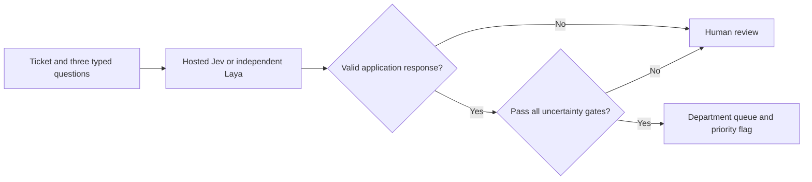

# 2. Validate answers, route tickets, and measure what happened

[Previous: typed decisions](01-typed-decisions.md) · [Back to the tutorial](README.md) · [Next: remote Laya](03-remote-laya.md)

A typed prediction becomes useful when application code decides how to handle it. Our example queues a ticket only after validating the response and checking three uncertainty signals. Otherwise it returns a review decision.



## Validate the fields your program needs

[common.py](common.py) checks that all three answers exist, their types match, the department belongs to the allowed set, and numeric values are finite and in range. Probability keys must match the question and sums must be within `0.001` of one. This tolerance accommodates rounded outputs; it is not a correction of bad predictions.

These checks catch wrong shapes, missing answers, NaN, boolean-as-number values, and invalid distributions. They cannot prove that a valid answer understood the ticket. The application also does not recompute a model's confidence formula: different backends may define it differently.

To exercise the policy without credentials or inference:

```bash
python3 -m unittest test_policy -v
```

Fixtures are hand-written test inputs. The tests show how your application reacts to invalid and uncertain data; their labels and values are not a model evaluation.

## Make review behavior explicit

The default policy uses a teaching threshold of `0.8`:

```python
from common import route

decision = route(response_dictionary, threshold=0.8)
```

| Signal | Queue requirement |
| --- | --- |
| Department | `confidence >= threshold` |
| Urgency | `confidence >= threshold` |
| Refund intent | `max(p_yes, 1 - p_yes) >= threshold` |

The Noul gate treats confident “no” and confident “yes” symmetrically. For `p_yes=0.1`, its certainty measure is `0.9`; for `p_yes=0.5`, it is `0.5`. This gate is a chosen application heuristic, not the official Noul confidence-style formula. It shares a numeric threshold with the other gates for brevity; production applications should validate separate thresholds per question and backend.

Queued tickets use the predicted department, a high-priority flag when the expected urgency score is at least `1.5`, and a refund-request flag when `p_yes >= 0.5`. Review results include a reason such as `urgency_uncertain`. These are returned data; the example performs no payment or account change.

## Evaluate predictions and policy separately

The runner compares real predictions with the twelve synthetic expectations. `summarize()` reports:

| Metric | Denominator or interpretation |
| --- | --- |
| Valid outputs | All attempted tickets |
| Department correct | All attempted tickets; invalid outputs count as incorrect |
| Refund intent correct | All attempted tickets, using a `0.5` classification threshold |
| Urgency mean absolute error | Valid outputs only, explicitly labeled |
| Coverage | Queued tickets / all attempted tickets |
| Queued department correct | Correct department predictions among the queued tickets |

Report coverage beside queue accuracy. Reviewing every ticket gives no useful automatic coverage; queuing more tickets can admit confident mistakes. The “queued department correct” metric covers only department, not the whole decision or priority. No representative calibration claim follows from twelve examples.

## Replay thresholds without another model call

After a real run, use [evaluate.py](evaluate.py) to recompute decisions over its saved responses:

```bash
python evaluate.py runs/laya.json --thresholds 0.5 0.8 0.9
```

The script validates that the records correspond to this workload, then prints coverage and error metrics at each threshold. It never changes the recorded model outputs. Threshold replay reuses the same examples and cannot serve as an independent validation set.

T10 deliberately includes an instruction inside the ticket that asks for the wrong department. Inspect its actual output in [experiment notes](RESULTS.md). One successful example would not establish prompt-injection immunity; one failed example is enough to show that the schema alone does not prevent redirection. Keep instructions and input data conceptually separate, then evaluate the failure modes relevant to your application.
